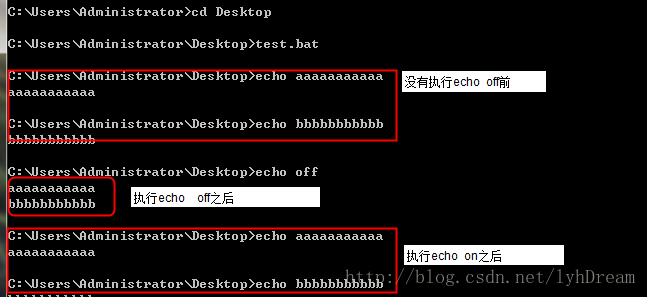

### echo

1. echo

- new line ```echo.```
- output variable ```echo %WEB_FOLDER%```
- output content ```echo [content]```

1. @echo off, @echo on

bat(批处理)文件的开头都会有@echo  off 这个命令
默认执行命令. 会输出该命令内容
@echo  off 只显示结果，而不显示执行的命令：
@echo on 显示执行的命令

```cmd
echo aaaaaaaaaaa
echo bbbbbbbbbbb
echo off
echo aaaaaaaaaaa
echo bbbbbbbbbbb
echo on
echo aaaaaaaaaaa
echo bbbbbbbbbbb
```

结果如下


### Define variable

```cmd
set WEB_FOLDER=Web

echo %WEB_FOLDER%
```

### Delete files and dictionaries

**del** to delete files:

```cmd
del %WEB_FOLDER%\bin\*.* /q
```

 [rmdir](https://technet.microsoft.com/en-us/library/bb490990.aspx)

```cmd
rmdir "%MODEL_FOLDER%\bin\Release"  /s /q
```

Parameters:

- /s: Removes the specified directory and all subdirectories including any files
- /q: Runs in quiet mode. Deletes directories without confirmation, or it will display like "Sure to delete, enter to confirm..."
- /?: Displays help at the command prompt
